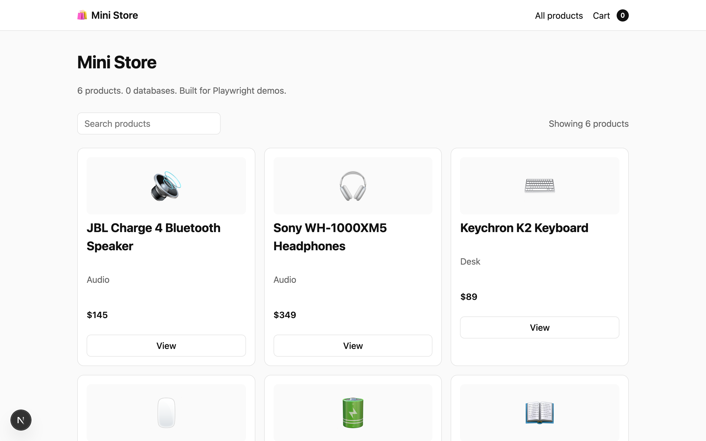
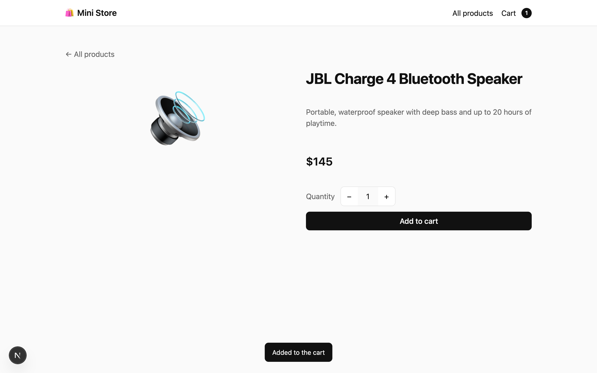

# Mini Store

A 6-product e-commerce store built for Playwright demos, with its Playwright tests in the same repo.

**Live:** https://mini-store-ebon-delta.vercel.app

This is **application code**: a Next.js store you can run, deploy and break on purpose. The `tests/` folder holds the Playwright suite that checks it, streamed to [TestDino](https://testdino.com) on every run.



## What is in here

| Path | What it is |
| --- | --- |
| `app/` | The store. Home with search, product page, cart, checkout, order confirmation. |
| `data/products.json` | The whole product catalog. The only "database". |
| `data/store.json` | Store name, button labels, confirmation copy. |
| `lib/cart.ts` | Cart in the browser's localStorage. No server state. |
| `tests/store.spec.ts` | 5 Playwright tests that cover the shopping journey. |
| `playwright.config.ts` | Starts the dev server, points tests at it, streams results to TestDino. |

No database, no API, no auth. Every page is static, so it deploys to Vercel with zero configuration.

## Run the store

```bash
npm install
npm run dev          # http://localhost:3100
```

## Run the tests

```bash
npx playwright test
```

The config boots the dev server if it is not already running. Every interactive element has a `data-testid`, so locators stay stable while you change the UI.

Stream the run to TestDino:

```bash
cp .env.example .env     # then put your TestDino API key in TESTDINO_TOKEN
npx playwright test
```

The reporter prints the run link before the tests finish. Without a token the suite runs exactly the same, with the list reporter only.



## Break it on purpose

Each edit is 1 line and turns a known test red. Rerun, and watch TestDino classify the failure.

| Edit | File | Test that fails |
| --- | --- | --- |
| `"addToCartLabel": "Add to bag"` | `data/store.json` | add to cart updates the header badge |
| `"price": 155` on the JBL speaker | `data/products.json` | product page shows the listed price, checkout places an order |
| Delete the Kindle entry | `data/products.json` | home lists all 6 products |
| Change `confirmationTitle` | `data/store.json` | checkout places an order |

Revert the edit and rerun, or update the test to match the new behaviour.

## Deploy

Deployed on Vercel at https://mini-store-ebon-delta.vercel.app from this repo's `main` branch, Next.js preset, no environment variables. Point the tests at it with `BASE_URL=https://mini-store-ebon-delta.vercel.app npx playwright test`.
